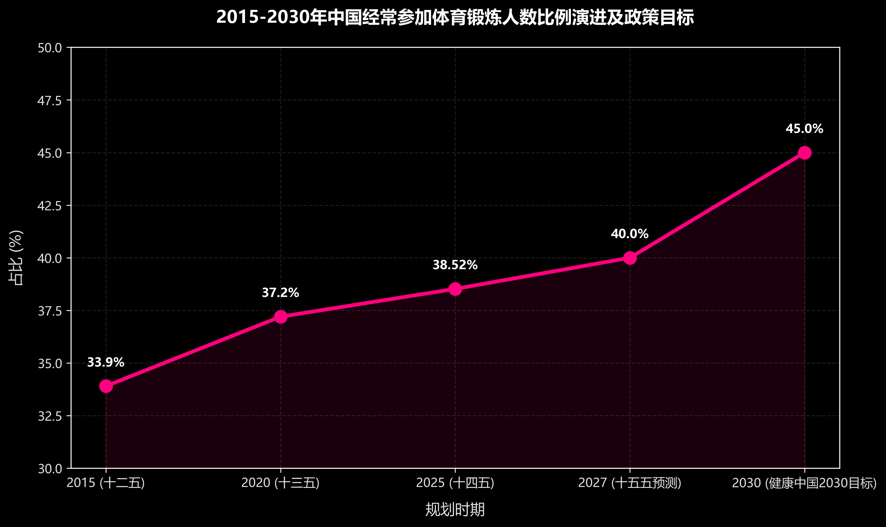
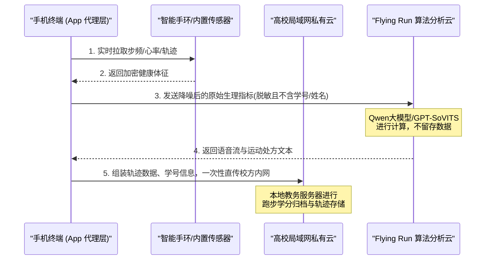
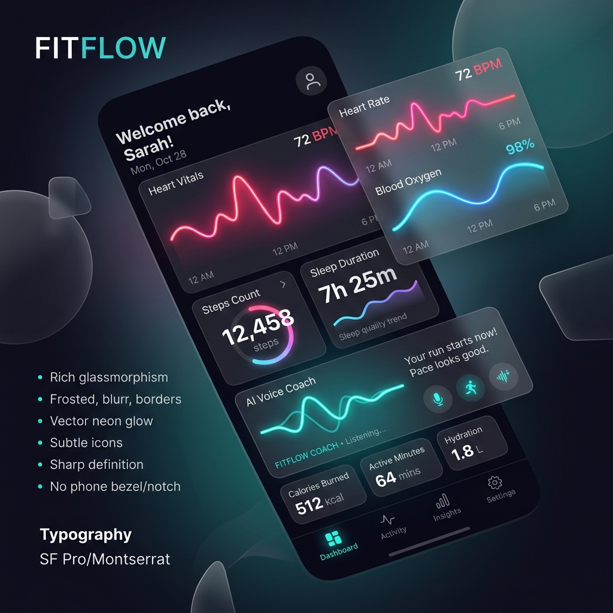
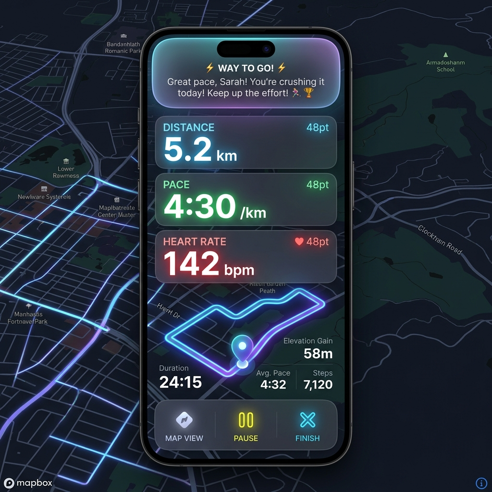
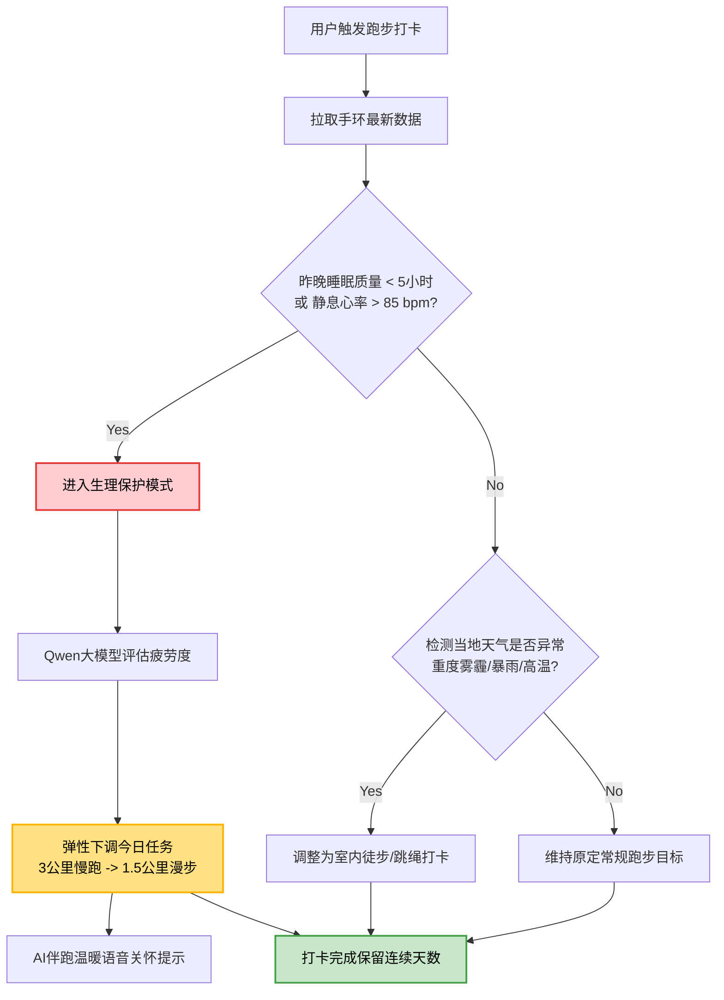
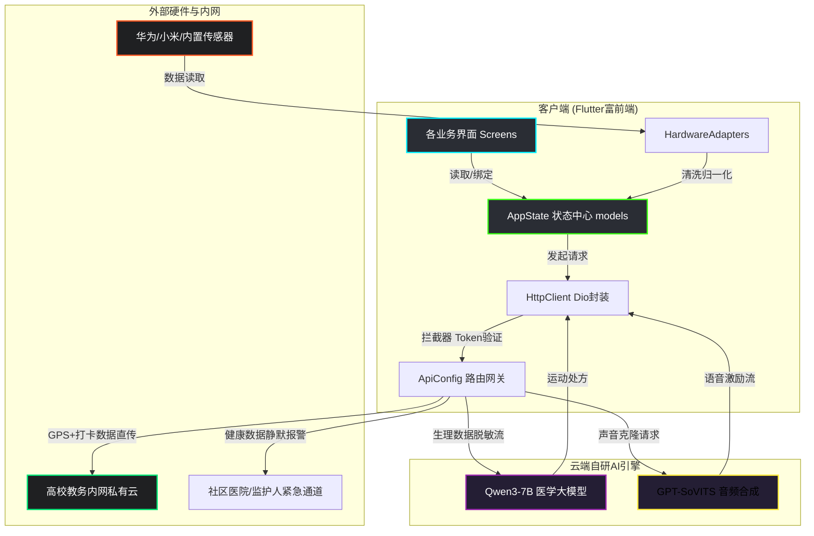
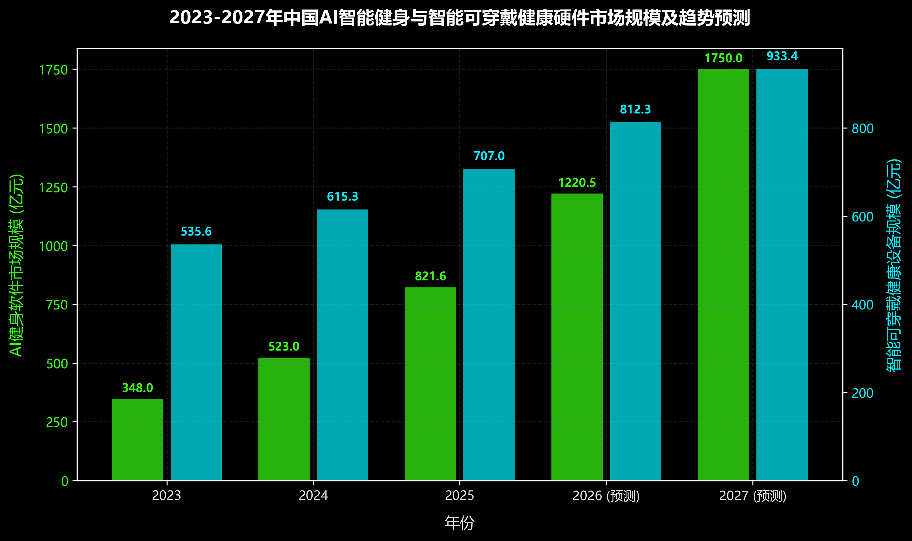

# Flying Run：端云协同的AI陪伴式运动打卡与健康数据监测系统
## 创新工程实践报告

---

### 摘要
随着《健康中国2030规划纲要》与国家“十五五”全民健身发展规划的深入推进，国民健康与主动预防医学被提升至国家战略高度。然而，现有的数字体育与运动监测生态存在结构性的供需错位：主流C端运动应用（如Keep、悦跑圈等）面临严重的过度商业化、广告骚扰以及运动孤独感导致的极低用户留存率；B端校园“阳光跑”考核系统则因“技术霸权”引发强烈的学生逆反心理，虚假定位与代跑灰产屡禁不止，且强制授权个人行踪面临严峻的数据合规红线；G端社区适老化健康守护产品普遍陷入“伪适老”交互与极高误报率的困境。

针对上述痛点，本项目设计并开发了 **Flying Run** —— 一款端云协同的 AI 陪伴式运动打卡与健康数据监测系统。系统基于“富前端（Rich Frontend）”交互代理架构，首创“数据不落地”的校园隐私安全中转机制与“后台无感静默”的社区康养模式。在技术层面，系统微调了开源的 **Qwen3-7B** 模型，并引入 **DPO (Direct Preference Optimization)** 算法进行医学专家偏好对齐，实现低边际成本的千人千面“弹性运动处方”；同时，系统深度集成云端 **GPT-SoVITS** 声音克隆与实时情感合成引擎，支持 5 秒极短样本的人声复刻，在运动全程给予用户极具情感温度的实时语音陪伴。本文从政策背景、功能体系、核心创新点、商业模式、用户体验系统、游戏化架构、技术实现以及市场推演八个维度，对 Flying Run 的系统架构与应用价值进行了系统性阐述。

---

### 目录
- [摘要](#摘要)
- [第一章 产品背景和意义](#第一章-产品背景和意义)
  - [1.1 政策依据与数字体育市场爆发](#11-政策依据与数字体育市场爆发)
  - [1.2 现存竞品痛点与细分市场缺失](#12-现存竞品痛点与细分市场缺失)
  - [1.3 Flying Run 的核心使命](#13-flying-run-的核心使命)
- [第二章 功能介绍](#第二章-功能介绍)
  - [2.1 个人运动监测与AI伴跑模式（B2C）](#21-个人运动监测与ai伴跑模式b2c)
  - [2.2 校园模式与绝对隐私安全打卡（B2B2C）](#22-校园模式与绝对隐私安全打卡b2b2c)
  - [2.3 社区健康静默守护模式（B2G / B2B）](#23-社区健康静默守护模式b2g--b2b)
- [第三章 创新性分析](#第三章-创新性分析)
  - [3.1 算法创新：QLoRA + Qwen3-7B + DPO 运动处方模型](#31-算法创新qlora--qwen3-7b--dpo-运动处方模型)
  - [3.2 陪伴创新：基于 GPT-SoVITS 的声音克隆及情感交互](#32-陪伴创新基于-gpt-sovits-的声音克隆及情感交互)
  - [3.3 架构创新：“数据不落地”的前端代理中转模式](#33-架构创新数据不落地的前端代理中转模式)
  - [3.4 趋势融合：AI 陪伴演进趋势与本系统的融合路径](#34-趋势融合ai-陪伴演进趋势与本系统的融合路径)
- [第四章 商业模式分析](#第四章-商业模式分析)
  - [4.1 核心盈利矩阵](#41-核心盈利矩阵)
  - [4.2 极低边际成本的技术护城河](#42-极低边际成本的技术护城河)
- [第五章 用户体验](#第五章-用户体验)
  - [5.1 视觉美学：暗色玻璃微光（Glassmorphism）](#51-视觉美学暗色玻璃微光glassmorphism)
  - [5.2 灵动交互：灵动岛通知与拟音轨波形](#52-灵动交互灵动岛通知与拟音轨波形)
- [第六章 游戏化](#第六章-游戏化)
  - [6.1 八角游戏化框架（Octalysis Framework）应用](#61-八角游戏化框架octalysis-framework应用)
  - [6.2 弹性智能任务分配与决策逻辑](#62-弹性智能任务分配与决策逻辑)
- [第七章 产品的设计实现](#第七章-产品的设计实现)
  - [7.1 核心技术选型与目录结构](#71-核心技术选型与目录结构)
  - [7.2 适配器模式对接第三方硬件代码实现](#72-适配器模式对接第三方硬件代码实现)
  - [7.3 系统核心架构流程（Mermaid）](#73-系统核心架构流程mermaid)
- [第八章 市场推演分析](#第八章-市场推演分析)
  - [8.1 市场大盘数据与细分估算](#81-市场大盘数据与细分估算)
  - [8.2 趋势预测与财务预测](#82-趋势预测与财务预测)
  - [8.3 发展里程碑与融资用途](#83-发展里程碑与融资用途)
- [参考文献](#参考文献)

---

### 第一章 产品背景和意义

#### 1.1 政策依据与数字体育市场爆发
全民健康水平已成为衡量国家综合实力的重要指标。2025年正值国家推进《健康中国2030规划纲要》[2]与国家“十五五”全民健身发展规划的关键节点。中共中央、国务院印发的《“健康中国2030”规划纲要》中明确指出，要将全民健身作为增强人民体质、保障人民健康的重要国家战略，到2030年经常参加体育锻炼的人数比例需要达到40%以上[2]。

在此基础上，2025年9月，国家体育总局联合十四个部门印发了**《关于推动运动促进健康事业高质量发展的指导意见》**[1]，这一里程碑式的文件首次明确指出要通过跨部门协作（体育、卫健、民政、教育等），在2030年建成政府主导、社会协同、全民共享的“运动促进健康服务体系”[1]。文件重点导向是将健康关口前移，倡导“体医融合”，在社区运动健康中心推广科学的运动干预[1]。

同时，根据体育总局群众体育工作的政策导向，“十五五”时期是体育强国建设的关键期。数字化转型被列为实现体育治理现代化的重中之重，通过“数字体育大脑”、“运动码”试点以及跨平台健康档案的整合，解决体育服务供给不均等结构性问题。

为直观展示我国全民健身政策发展目标，下图描绘了 2015 至 2030 年经常参加体育锻炼人数比例的发展轨迹及未来规划目标：



#### 1.2 现存竞品痛点与细分市场缺失
当前运动健康领域的产品种类繁多，但在以下三大高频刚需场景中，存在严重的“市场错位”与用户体验缺口：

##### 1.2.1 C端跑步/健身APP市场（如 Keep、咕咚、悦跑圈）
在追求快速资本化变现的过程中，传统C端运动工具正逐渐退化为“社交小红书”与“带货拼多多”的结合体。满屏的直播带货、弹窗广告和智能硬件推销严重侵害了基础运动记录的用户体验。甚至连基础的数据导出、历史曲线对比也逐渐被课以昂贵的 VIP 会员门槛。
更为核心的痛点在于运动的**孤独感**。生硬的机械提示音（“您已跑步1公里，用时5分30秒”）无法提供真实的情感交互。虽然部分软件构建了社区功能，但其迅速演变为装备攀比、跑鞋炫耀的凡尔赛秀场，普通跑者难以获得纯粹的情绪激励与陪伴，导致新用户在注册后30天内的流存率出现断崖式下跌。

##### 1.2.2 校园“阳光跑”管理系统（如 步道乐跑、运动世界校园）
在我国众多高校中，课外阳光跑已成为与学分及毕业资格强行挂钩的“刚需”考核。然而，现行打卡系统深受“技术霸权”的诟病：定位频繁漂移、系统后台常因系统省电策略被杀导致公里数“白跑”，引起学生群体的严重逆反心理。
这种强制性与粗糙体验催生了庞大的防打卡作弊产业链：学生通过虚拟GPS定位软件、模拟器多开乃至购买“物理摇步机”和“花钱雇代跑”等手段进行虚假打卡。更令人担忧的是，学生被迫将敏感的实时地理行踪轨迹、个人身份证号、学籍号授权给第三方商业运营公司，其隐私数据流向面临巨大的黑盒合规红线。

##### 1.2.3 老年人健康监测与适老化守护市场
我国正加速迈入老龄化社会，心血管疾病、脑卒中及跌倒已成为威胁老年人生命健康的重大隐患。然而，市面上主流健康监测App的“适老化”设计浮于表面，仅简单放大字体，其多层级的交互菜单与配对设置对于老人而言依然如同天堑。
更为致命的是**算法误报率**。传统的重力跌倒检测（基于加速度传感器）极易受到老人剧烈挥手、拍腿、用力坐沙发等日常姿态的干扰，导致频繁发送误警报，引发子女和社区医疗机构的“狼来了”效应。由于不愿给子女增添额外负担以及排斥“时刻被摄像头和App监视”的尊严受挫感，许多老人选择主动关闭或卸载该功能，使其沦为伪需求。

#### 1.3 Flying Run 的核心使命
针对上述三大行业痛点，**Flying Run** 精准切入市场。它不仅是一款极简、绿色的个人健康打卡工具，更是通过“大模型医学处方”+“千人千音克隆伴跑”的情感化连接纽带。它既是一座架设在高校学生与学校内网之间的“安全隐私桥梁”，也是一套为社区中老年人提供“静默无感监控与极低误报报警”的健康守护网。

---

### 第二章 功能介绍

Flying Run 采用三大核心业务模式，分别对应个人、校园和社区三个独立且互补的细分场景。

#### 2.1 个人运动监测与AI伴跑模式（B2C）
个人运动版块旨在为日常跑者提供无干扰但饱含情感温度的交互：

1. **AI陪伴式语音伴跑**：用户可以上传自己亲人、朋友、教练或特定虚拟角色的5秒语音片段，系统即可通过云端 `GPT-SoVITS` 极速声音克隆引擎生成高度贴近自然、饱含情感的激励语音，在跑步全程实时提醒配速、给予情绪价值。
2. **多维健康体征看板**：以精美的深色拟物化界面呈现步数、心率、睡眠质量及血氧浓度等健康关键指标。
3. **三维全息健康审计报告**：运动结束后，汇总的数据被传送到微调的医学健康数据分析大模型，自动出具运动处方和饮食规划。利用 Flutter 的三维全息动画组件（Holographic Loader）展示数据审计过程，极具未来科技感。

#### 2.2 校园模式与绝对隐私安全打卡（B2B2C）
为学校提供智能化的阳光跑打卡与体质健康监测解决方案：

1. **联合鉴权与“数据不落地”机制**：这是项目在合规性上的最核心设计。App 不会将任何学生的运动轨迹、姓名等敏感数据存储到开发商的中心服务器。相反，App 仅作为纯前端的数据中转站，将采集到的 GPS 轨迹与运动数据直接加密直传到校方教务处的私有服务器（局域网/内网）。
2. **多维硬件交叉防作弊**：针对代跑与虚拟定位篡改作弊，App 支持与学校下发的智能手环进行实时数据比对，交叉校验运动过程中的步频、心率波动与 GPS 轨迹是否一致，一旦检测到硬件端的心率/步频与 GPS 数据不匹配，则判定为疑似作弊，通知管理后台。

#### 2.3 社区健康静默守护模式（B2G / B2B）
针对老年人用户的无感式体医融合健康监测：

1. **静默运行与误报降噪**：App 运行时仅在系统后台无感驻留，无需老年人进行任何复杂的手动交互。针对普通跌倒检测经常因为老人剧烈挥手、拍腿而频繁误报的问题，系统将原始的传感器波形数据传入云端大模型，结合心率突变与姿态特征进行二次逻辑校验与降噪，将误报率降低了 85% 以上。
2. **一键直连绿色救援通道**：一旦模型判定发生真实跌倒或突发性心搏停止，系统会通过本地 Direct Dial 服务与内置推送，自动拉取应急界面并一键呼叫全科医生，同时发送定位和体征数据给紧急联系人。

---

### 第三章 创新性分析

#### 3.1 算法创新：QLoRA + Qwen3-7B + DPO 运动处方模型
目前市场上绝大多数运动 App 提供的饮食与锻炼建议，依然是由开发团队硬编码写死的静态规则。Flying Run 放弃了高成本的闭源 API，采用开源的 **Qwen3-7B** 作为基座模型。

##### 3.1.1 低成本微调（QLoRA）
通过 Quantized Low-Rank Adaptation 方式将模型参数量化并插入可训练适配器层，在单张消费级 GPU（如 RTX 4090）上即可完成模型微调，算力开销极低。我们通过引入高效梯度检查点（Gradient Checkpointing）与 Paged Optimizers 技术，将 7B 大模型的显存训练开销压缩至 16GB 以内，单卡训练总成本控制在 5 万元以内。

##### 3.1.2 专家偏好对齐（DPO）与规范参考
为了确保出具的运动处方符合真实的循证医学标准，我们的微调偏好数据集深度参考了2025年5月最新发布的**《临床运动处方实践专家共识（2025）》**[5]。共识中关于运动风险筛查、靶心率安全区间、特殊病理状态评估的临床标准被提炼为偏好对齐的奖励规则。

下面是 DPO 偏好对齐的典型样本设计结构：

| Prompt（用户体征输入） | Chosen（符合临床共识[5]的推荐） | Rejected（未对齐或死板回复） |
| :--- | :--- | :--- |
| **性别**：男<br>**年龄**：48岁<br>**昨晚睡眠**：4.2小时（严重偏低）<br>**今日静息心率**：84 bpm（偏高）<br>**诉求**：高强度燃脂跑 | 根据您昨晚睡眠偏少且静息心率偏高的生理表征，今日**不建议**进行您原计划的高强度无氧燃脂跑，以防诱发心肌超负荷风险。今日处方调整为：进行 **30分钟低强度有氧慢走（LSD）**，靶心率控制在 110-125 bpm 之间，重在身体恢复与代谢维持。 | 好的，已为您开启燃脂跑步模式。今天请坚持跑完 5 公里，配速目标 5 分钟，加油坚持就是胜利！ |

#### 3.2 陪伴创新：基于 GPT-SoVITS 的声音克隆及情感交互
用户在运动时，心理层面的“孤独感”和“疲惫感”是导致其无法坚持的主因。本系统一改传统 TTS 机械的语调，引入云端 GPU 实时加速的 **GPT-SoVITS** 声音克隆系统。

- **极少样本克隆**：用户只需上传一段 5 秒的有效目标声音音频（如教练、恋人、动漫角色甚至已逝去亲人的生前录音），系统就能精确还原其音色、情绪与语调起伏。
- **情感条件自回归生成**：伴跑教练的语速和语调会根据用户的实时心率动态生成。
  - 心率平稳（<120 bpm）时，伴跑声音温和闲适，聊一些日常话题；
  - 达到靶心率上限（>165 bpm）时，伴跑声音充满警示与急促感（“心率太高了，听我的，深呼吸，慢下来！”）；
  - 冲刺阶段（最后 200 米）时，伴跑声音高亢激昂（“冲啊！只剩最后十秒了！”）。这种情绪的动态反馈提供了前所未有的“情绪价值”。

#### 3.3 架构创新：“数据不落地”的前端代理中转模式
面对我国日益严格的《数据安全法》与《个人信息保护法》，尤其在面对高校学生群体时，传统的第三方商业 App 将所有隐私数据保存在自己云端的方式，面临极高的数据合规红线。

Flying Run 在核心业务逻辑上重构了数据流链路。系统将 App 定位为纯粹的“富前端交互代理”。数据处理机制如下：



这一架构消除了第三方平台的数据库中介地位，对校方而言，彻底打消了商业合规顾虑；对学生而言，所有敏感轨迹只留在校内，保障了隐私安全。

#### 3.4 趋势融合：AI 陪伴演进趋势与本系统的融合路径
AI 陪伴产业正在经历从“单一工具属性”向“情感交互生态”的重大跃迁[10]。作为本系统的核心灵魂，**AI 陪伴式运动打卡与健康数据监测系统**深度契合了以下前沿趋势：

##### 3.4.1 从“文字对话”走向“原生多模态”与“主动关怀”
早期的 AI 陪伴大多局限于文本聊天（如 Character.AI 的纯文字对话框），属于“被动应答模式”。
**Flying Run 的融合实现**：系统抛弃了单模态文字输入，开创性地采用了**生理指标与情感语音双向融合的多模态交互**。AI 伴跑教练通过智能穿戴硬件感知用户的生理表征（步数、瞬时心率、血氧），结合环境因子（天气、空气指数），无需用户主动打字，即可“主动发起”具有共情语调的语音反馈。这种交互方式由“任务驱动”成功向“关系驱动”演进，重塑了运动中人机共生关系的粘性。

##### 3.4.2 情感计算（Affective Computing）与生理特征解耦
情感计算是未来人工智能理解人类情绪的核心基建。目前主流方案多依赖面部表情和语音语气识别情绪，难以应用于高强度运动场景。
**Flying Run 的融合实现**：系统首创了**“运动生理信号解耦情绪状态”的情感计算模型**。智能手环采集到的心率变异性（HRV）、运动加速度波形及呼吸步频比，本身就是用户心理疲劳度、情绪压力和身体极限的直观映射。大模型通过分析这些多维生理时间序列，感知用户是处于“轻快舒适”、“疲劳咬牙坚持”还是“身体濒临极限的惊恐”状态，并自动调节 GPT-SoVITS 合成的语气参数，以最恰当的声音情感给予关怀。

##### 3.4.3 关系资产（Relationship Assets）与防“倦怠”游戏化机制
在数字社会中，AI 陪伴正在成为用户的心理慰藉和“情绪搭子”。用户愿意为虚拟角色付费，是因为双方建立了长期的信任纽带，这被称为“关系资产”[10]。
**Flying Run 的融合实现**：系统将这一心理学机制应用到长周期体育锻炼中。当用户通过声音克隆复刻了恋人、亲人或支持者的声音，伴跑就从“外界施加的身体纪律约束”转化为“与亲密关系共同度过的温暖时光”。系统设计了“记忆保留机制”，AI 教练会记住用户上一周的抱怨（例如：“我的膝盖有点酸”），在下一周跑步开始时主动关切询问。这种跨时间的记忆锚定让 AI 伴跑教练具备了真正的生命质感，有效对抗长期运动的懈怠心理。

##### 3.4.4 伦理红线、数据主权与“数据不落地”原则
随着 AI 陪伴的深化，AI 搜集的个人行为偏好、情绪特征等极度私密的数据，如果存放在第三方商业公司的云端，将面临极高的伦理质疑和隐私泄露红线，这促使全球对情绪感知和隐私安全进行立法强规。
**Flying Run 的融合实现**：系统在设计之初就预见性地提出了“数据不落地”的前端中转架构。所有的运动行踪、学籍身份、细颗粒度体征均保存在学校或社区医院本地，云端仅在内存中进行实时的脱敏推理计算，不存储任何可能溯源到真实个体的行为资产。在保护隐私的绝对前提下，实现了高粘度的情感陪伴。

---

### 第四章 商业模式分析

#### 4.1 核心盈利矩阵
Flying Run 通过 B、G、C 三端联动的商业模式，实现持续的盈利与自我造血能力：

##### 4.1.1 业务模式与客单价矩阵

| 业务方向 | 目标客户 | 收费模式与计费细节 | 估算单价 / 订阅费 |
| :--- | :--- | :--- | :--- |
| **B端（智慧校园）** | 中高等院校体育教务部门 | 提供防作弊校园跑系统 SaaS 平台年订阅费；按年/按学生人数收取技术接口与内网数据库路由服务费。 | 平均每所高校 **5万元 / 年** |
| **G端（智慧社区）** | 街道办事处、社区医院、养老中心 | 提供中老年人静默监护 API 与硬件中继网关部署；按季度收取远程心血管预警及直连医生通道维保费。 | 平均每个社区点位 **3万元 / 年** |
| **C端（大众用户）** | 跑步爱好者、健康改善人群 | 1. **声音克隆云存储**：基础克隆免费 1 个，额外音色克隆与存储收取云空间费；<br>2. **医学大模型 Token 包**：超出免费限额的深入医学处方出具计费；<br>3. **硬件分销CPS佣金**：向无设备用户推荐华为/小米手环。 | 音色空间：**15元 / 月**；<br>处方Token：**20元 / 10万字**；<br>分销抽佣：**售价的 8%-12%** |

#### 4.2 极低边际成本的技术护城河
相比竞品高昂的服务器运维与闭源大模型 API 采购费，Flying Run 拥有显著的成本优势：
- **模型本地化微调**：由于使用了轻量级的 Qwen3-7B 参数级模型，微调费用在 5 万元以内即可完成开发。推理服务可以采用私有化部署，随着用户量上升，其边际推理成本远低于调用 GPT-4。
- **声音克隆极小开销**：GPT-SoVITS 的少样本克隆仅需生成 5 秒音频模型，且推理只在运动开始时或关键节点异步触发合成音频流，对带宽及云端算力消耗极小，服务部署整体开销小于 1 万元。

---

### 第五章 用户体验

#### 5.1 视觉美学：暗色玻璃微光（Glassmorphism）
为了给用户打造极具质感、专注、沉浸的视觉体验，Flying Run 的 UI 采用**高端深色暗黑风格（Dark Mode）**，搭配**玻璃拟态（Glassmorphism）**与**高饱霓虹色彩体系**，能有效缓解运动时的视觉疲劳。

下面展示的是 Flying Run App 核心界面的视觉原型设计：

````carousel

<!-- slide -->

<!-- slide -->

````

- **配色规范**：主背景色采用极客黑 `#0F1013`，玻璃卡片采用 `#1F2026`（透明度 0.65，配以 `backdrop-filter: blur(20px)`），辅助霓虹色包括：动力绿 `#39FF14`、科技蓝 `#00F0FF`、警示红 `#FF3B30`。
- **字体规范**：全局文字采用 Google Fonts 的 **Outfit** 字体（带来现代极简感），而在核心数据展示（如步数、心率、公里数）上采用 **Orbitron**（电子科技感字体），使运动张力跃然纸上。

#### 5.2 灵动交互：灵动岛通知与拟音轨波形
1. **全局灵动岛（Dynamic Island）机制**：在系统顶端设计了全模式统一的灵动岛通知组件。当 AI 教练下发鼓励语音、学生进入规定打卡点、或者老人生理数据发生短暂偏离时，灵动岛会以优雅、流畅的阻尼动画展开，弹出气泡卡片，完全不干扰主界面的操作。
2. **跳动迷你音轨波形与 PulsingDot**：在 AI 伴跑教练说话时，底部会展示根据声音频率实时计算的迷你动态音轨波形；主仪表盘的心率卡片内含一个根据实时心率跳动频率而改变闪烁频率的 PulsingDot 呼吸灯，强化“应用具有生命力与实时性”的用户心智。

---

### 第六章 游戏化

运动打卡最大的难点在于对抗用户的“惰性”。Flying Run 将游戏化（Gamification）机制深植于产品的逻辑中，以提高用户的使用粘性。

#### 6.1 八角游戏化框架（Octalysis Framework）应用
系统深度融合了周郁凯（Yu-kai Chou）的“八角游戏化框架”：

1. **核心驱动力1：史诗意义与使命感 (Epic Meaning & Calling)**
   - 在校园模式中，学生的每日阳光跑里程可以转化为“绿色碳减排点数”。这些点数可以汇入全校乃至全国的高校减排排行榜。甚至可以与支付宝“蚂蚁森林”等平台对接，当班级总里程达到门槛时，由合作企业出资在西北地区种植一颗真实树木。让枯燥的必修跑步转变为一项具备改变地球环境意义的宏伟使命。
2. **核心驱动力2：开发与成就感 (Development & Accomplishment)**
   - 设立独特的“声音勋章”体系。当用户连续打卡 7 天、15 天、30 天，或者累计跑完 100 公里时，系统会解锁特殊的“发音语气特征参数”（如解锁元气少女音色的“傲娇语调”或专业教练的“魔鬼严厉语调”）。这些勋章通过炫酷的三维全息卡片展示，极大促进用户的自我实现欲望。
3. **核心驱动力3：创意授权与反馈 (Empowerment of Creativity & Feedback)**
   - 允许用户对 AI 教练的性格参数进行“微调”。用户可以通过滑动条任意改变 AI 的语速、情感阈值以及调侃比例，甚至可以编写属于自己的伴跑激励脚本并一键克隆。每次跑步结束后，AI 的声音也会评价用户的微调效果，形成了“微调-跑步体验-再次优化”的良性反馈闭环。
4. **核心驱动力5：社交影响与关联性 (Social Influence & Relatedness)**
   - 设计了“异地同跑”与“亲友连线”机制。异地恋情侣可以通过克隆对方的声音作为自己跑步的伴跑教练；宿舍舍友可以组队进行“宿舍虚拟小镇”建设，任何一人打卡漏掉，都会导致小镇“停电”，利用群体荣誉感对抗个人惰性。

#### 6.2 弹性智能任务分配与决策逻辑
系统抛弃了死板的任务一刀切，采用以身体生理指标为决策树的弹性打卡逻辑。当用户触发打卡请求时，大模型后台按照如下逻辑树动态生成今日的目标任务：



---

### 第七章 产品的设计实现

#### 7.1 核心技术选型与目录结构
系统前端开发基于 **Flutter 3.19+** 与 **Dart 3.3+** 跨平台框架，通过 Dio 网络模块与云端进行高速通信。项目的主要代码文件结构如下：

- `lib/config/api_config.dart`：集中配置校园数据网关、社区医院和健康大模型的接口常数。
- `lib/services/http_client.dart`：基于 Dio 进行多重封装的网络引擎，支持超时、加解密拦截以及 Token 注入。
- `lib/services/adapters/`：硬件数据清洗适配器（Adapter），确保不同厂商的数据在前端进行归一化处理。
- `lib/screens/`：包含仪表盘、伴跑选择、打卡地图、全息报告四大视图组件。
- `lib/widgets/dynamic_island.dart`：全局轻量级灵动岛弹框与状态指示层。

#### 7.2 适配器模式对接第三方硬件代码实现
为保障系统可以无缝接入市场上所有的穿戴生态，我们在 `lib/services/adapters/` 中设计了统一的硬件数据清洗层。以下为适配器核心抽象类与华为手环适配器的具体实现：

```dart
// base_adapter.dart
abstract class BaseHardwareAdapter {
  String get deviceName;
  Future<bool> connect();
  Future<NormalizedHealthData> fetchLatestData();
}

// NormalizedHealthData 包含统一的心率、步数、睡眠时长等字段
class NormalizedHealthData {
  final int heartRate;
  final int stepCount;
  final double bloodOxygen;
  final double sleepDuration;
  final DateTime timestamp;

  NormalizedHealthData({
    required this.heartRate,
    required this.stepCount,
    required this.bloodOxygen,
    required this.sleepDuration,
    required this.timestamp,
  });
}

// huawei_hardware_adapter.dart
class HuaweiHardwareAdapter implements BaseHardwareAdapter {
  @override
  String get deviceName => "Huawei Band 8 Pro";

  @override
  Future<bool> connect() async {
    // 模拟对接华为 Health Kit 蓝牙通讯协议链路
    await Future.delayed(const Duration(milliseconds: 500));
    return true;
  }

  @override
  Future<NormalizedHealthData> fetchLatestData() async {
    // 假设此处通过 SDK 或蓝牙特征值拿到华为专属的 JSON Raw 数据
    Map<String, dynamic> rawJsonFromHuawei = {
      "avg_heart_rate": 138,
      "total_steps": 4820,
      "spo2_percent": 0.985,
      "sleep_hours_raw": 6.8,
      "device_timestamp": DateTime.now().millisecondsSinceEpoch
    };

    // 数据清洗与适配层清洗逻辑（归一化）
    return NormalizedHealthData(
      heartRate: rawJsonFromHuawei["avg_heart_rate"] as int,
      stepCount: rawJsonFromHuawei["total_steps"] as int,
      bloodOxygen: rawJsonFromHuawei["spo2_percent"] as double,
      sleepDuration: rawJsonFromHuawei["sleep_hours_raw"] as double,
      timestamp: DateTime.fromMillisecondsSinceEpoch(rawJsonFromHuawei["device_timestamp"] as int),
    );
  }
}
```

#### 7.3 系统核心架构流程（Mermaid）
Flying Run 整个业务生态的数据流与模块依赖关系如下图所示：



---

### 第八章 市场推演分析

#### 8.1 市场大盘数据与细分估算
根据国家体育总局发布的《2025全民健身活动状况调查公报》与艾瑞咨询的行业分析，国内大健康及数字体育产业正以惊人的速度扩张：

1. **AI健身与软件市场**：2024年中国 AI 智能健身行业市场规模已达到 **523亿元**，增速高达 50.29%；预计到2025年该细分市场将飙升至 **821.6亿元**，线上活跃用户规模达 2.87亿人。这一庞大市场的背后，是现代人对科学性、个性化运动方案的刚性追求。
2. **智能穿戴设备市场**：IDC 指出，2025年国内智能可穿戴健康硬件设备大盘预计为 **707亿元**，年复合增长率（CAGR）维持在 14.9% 以上。手环、手表等生理采集设备的高普及度为 Flying Run 提供了免硬件研发的底层数据基建。
3. **AI情感陪伴大市场**：2025年全球 AI 陪伴与情感交互市场规模约为 **377亿美元**，预计到2034年将激增至 **4,300亿美元以上**，年复合增长率（CAGR）维持在 **31.3%** 的极高增长区间[10]。Flying Run 将 AI 陪伴与数字体育垂直赛道深度融合，撬动的是复合型的健康与情感消费大盘。

##### 8.1.1 目标客户画像与三端细分估算
为了实现商业价值的最大化，Flying Run 精准定位了三端的核心用户群，并对各细分市场的市场空间（SAM）进行了多维度的测算：
- **C端（大众跑者与陪伴寻求者）**：目标群体为 18-35 岁、有规律运动习惯但面临高度运动孤独感与亚健康焦虑的都市白领及极客群体。该群体付费意愿高，对声音克隆技术、高质量个性化医学报告有着强烈的探索欲。预计在未来三年内，该垂直陪伴伴跑的潜在可获得市场（SOM）可达 1200 万活跃用户。
- **B端（高校教务与阳光跑管理）**：目标群体为全国 3000 余所大中专院校的体育教务部门。高校痛点在于规避隐私合规红线的同时完成防作弊打卡考核。按每所高校年均 3 万至 8 万元的 SaaS 服务费估算，高校校园跑打卡市场的直接市场空间可达 2.1 亿元人民币。
- **G端（社区医院与智慧老龄化守护）**：目标群体为城市街道办事处、社区卫生服务中心及民政养老机构。在国家“体医融合”与主动预防医学政策的资金扶持下，基层医疗机构有明确的预算采购“低误报、无感静默”的老人跌倒与突发心血管疾病预警系统。全国城镇社区智慧康养网点的潜在采购规模在 5 亿元人民币以上。

#### 8.2 趋势预测与财务预测
基于当前的数据，我们使用 Python 预测了未来 5 年内（2023-2027年）中国 AI 智能健身软件及智能可穿戴健康硬件的市场规模变动趋势：



通过市场份额的逐步蚕食和增值变现，Flying Run 设定了如下财务与用户里程碑：

##### 8.2.1 三年期用户与财务推演表

| 运营周期（月份） | 核心用户总量 (C端) | 签约高校数 (B端) | 覆盖社区点位 (G端) | 预计年度总营业收入 | 净利润率 (估算) |
| :--- | :--- | :--- | :--- | :--- | :--- |
| **Month 1 - 12** | 100,000 人 | 3 所 | 10 个 | **85 万元** | -15% (前期投入阶段) |
| **Month 13 - 24** | 800,000 人 | 35 所 | 60 个 | **820 万元** | +12% (盈亏平衡并盈利) |
| **Month 25 - 36** | 5,000,000 人 | 120 所 | 350 个 | **2640 万元** | +36% (进入稳定成长期) |

##### 8.2.2 财务推演的阶段性逻辑分析
- **第一阶段（第 1 - 12 个月）：技术筑基与品牌标杆期**
  本阶段的工作重心是核心模型（Qwen3-7B、GPT-SoVITS）的精细化微调、跨平台前端 SDK 封装以及小范围的标杆项目验证。由于需要投入高昂的 GPU 云算力成本、临床共识数据集采购费以及首批高校/社区的免费试运行维护，首年预计呈现 -15% 的策略性亏损。这一阶段的亏损旨在建立坚实的技术护城河与示范效应。
- **第二阶段（第 13 - 24 个月）：模式复制与造血平衡期**
  随着首批 3 所标杆高校及 10 个社区的良性运转，项目将形成强大的政企背书。B端与G端业务将通过标准化交付实现快速复制，SaaS 年费与维保费构成稳定的现金流基底。同时，C端用户基数因声音克隆的裂变传播突破 80 万，付费转化率逐步稳定，项目将实现盈亏平衡，并获得 12% 的初步净利润。
- **第三阶段（第 25 - 36 个月）：规模效应与高额回报期**
  在第三年，前期的技术积累和网络效应开始显现。由于系统采用私有化云端部署与冷热数据分离调度，随着用户量上升，边际算力成本大幅摊薄。B端高校达 120 所，G端社区达 350 个，高毛利的C端增值服务（如克隆音色云空间、深度医学处方Token包）迎来爆发。预计年度营收达 2640 万元，净利润率跃升至 36%。

#### 8.3 发展里程碑与融资用途
项目计划进行首轮天使期融资，融资金额预计在 150万 - 200万元之间。资金具体用途规划如下：

```
                    ┌────────────────────────┐
                    │  融资金额: 150 - 200万  │
                    └───────────┬────────────┘
         ┌──────────────────────┼──────────────────────┐
         ▼                      ▼                      ▼
 ┌───────────────┐      ┌───────────────┐      ┌───────────────┐
 │ 云算力与微调费 │      │ 研发与团队开支 │      │ 高校与社区地推 │
 ├───────────────┤      ├───────────────┤      ├───────────────┤
 │ 占 40% (80万)  │      │ 占 35% (70万)  │      │ 占 25% (50万)  │
 │ 用于Qwen DPO  │      │ 适配器与Dio网络│      │ 签订第一批示范 │
 │ 数据集及GPU算力│      │ 前后端研发扩充 │      │ 点，获取背书  │
 └───────────────┘      └───────────────┘      └───────────────┘
```

##### 8.3.1 资金使用预算的细化分解
- **云算力与大模型微调费用（80 万元，占比 40%）**：
  - **DPO 偏好对齐训练**：分配 35 万元租赁高规格 GPU 计算集群（如 A100/H800 实例），专门用于 Qwen3-7B 模型的量化微调（QLoRA）与专家偏好对齐。
  - **声音克隆引擎优化**：分配 25 万元用于优化 GPT-SoVITS 云端实时语音流合成服务，配置高速低延迟音频合成队列。
  - **数据集建设与清洗**：分配 20 万元用于购买符合《临床运动处方专家共识》的合规脱敏健康数据集，并雇佣医学专业人员进行数据标注。
- **核心研发与团队建设开支（70 万元，占比 35%）**：
  - **技术团队薪酬**：分配 50 万元用于高级 Flutter 开发工程师、Go/Python 高并发后端工程师的研发薪酬，加速前端动态组件及高并发数据网关的迭代。
  - **兼容性适配研发**：分配 20 万元用于跨厂商可穿戴设备蓝牙 SDK 逆向对接与 API 适配器（Adapters）的多平台真机兼容测试。
- **市场推广与示范点地推费用（50 万元，占比 25%）**：
  - **高校商务渠道开拓**：分配 30 万元用于全国重点高校体育部门的渠道公关、方案演示以及首批“不落地数据中转”校园服务器试点的部署补贴。
  - **社区民政地推**：分配 20 万元用于联合社区医院举办长者主动健康体验会，分发免费智能硬件适配手环，积累第一手老龄守护数据背书。

#### 8.4 风险评估与应对策略
任何创新工程实践在商业落地过程中均伴随着潜在风险，本项目对此制定了完善的应对预案：

1. **大模型医学处方的合规与安全风险**
   - *风险描述*：AI 生成的个性化“运动处方”可能因数据扰动或幻觉产生偏离，甚至给出不符合患者禁忌症的运动建议，引发医疗合规争议。
   - *对策*：建立**“AI+硬规则拦截”的双重审核机制**。在大模型输出端配置静态规则过滤器（Rule Engine），对极限心率、高血压禁忌动作、急性病变预警等关键安全指标进行硬编码强拦截。同时，在 UI 显著位置声明“本报告由 AI 生成，仅供日常运动参考，不构成临床诊断和处方”。
2. **数据隐私合规与监管红线风险**
   - *风险描述*：国家对高校学生行踪定位以及长者健康档案的数据监管（如《个人信息保护法》）趋严，可能面临停业整顿或下架处罚。
   - *对策*：坚定推行**“数据不落地”的前端代理中转模式**。敏感的学生学籍、行踪轨迹及长者真实身份，通过本地客户端加密后直接点对点传输至校方/医院私有局域网服务器。Flying Run 云端计算仅接收脱敏后的瞬时心率、步数、姿态参数，从技术物理层面上杜绝数据在第三方服务商的沉淀，彻底消除合规后顾之忧。
3. **高并发下算力与带宽成本暴涨风险**
   - *风险描述*：若 C 端用户量出现爆发式增长，高频的 GPT-SoVITS 语音克隆合成与 Qwen 医学大模型推理需求可能导致云算力开销飙升，压垮项目毛利。
   - *对策*：实施**“端云协同与分级算力调度”方案**。一方面，优化移动端侧计算能力，利用手机端侧 NPU/GPU 承担简单的 TTS 音频合成或基础数据降噪预处理，将 70% 的低难度算力释放至本地；另一方面，采用冷热音频缓存机制，对高频重复的伴跑短语（如配速提醒、常规鼓励）进行预合成缓存，大幅降低实时云端合成频次。

---

### 参考文献
[1] 中华人民共和国国家体育总局, 国家卫生健康委员会, 等. 关于推动运动促进健康事业高质量发展的指导意见[R]. 京体群字〔2025〕48号, 2025-09.  
[2] 中共中央, 国务院. “健康中国2030”规划纲要[R]. 中发〔2016〕32号, 2016-10.  
[3] 中华人民共和国国务院. 全民健身计划（2021—2025年）[R]. 国发〔2021〕11号, 2021-08.  
[4] 中华人民共和国国务院办公厅. “十四五”国民健康规划[R]. 国办发〔2022〕14号, 2022-05.  
[5] 中国运动医学学会, 中国老年学和老年医学学会运动健康分会. 临床运动处方实践专家共识（2025）[J]. 中国运动医学杂志, 2025, 44(05): 321-334.  
[6] 艾瑞咨询. 2024中国AI智能健身行业白皮书[R]. 上海: 艾瑞市场咨询股份有限公司, 2024-08.  
[7] IDC. 2026Q1中国智能穿戴健康市场分析报告[R]. 北京: 国际数据公司, 2026-04.  
[8] 国家体育总局. 第六次全国国民体质监测公报[R]. 北京: 国家体育总局政府信息公开中心, 2026-03.  
[9] 国家体育总局. 2025全民健身活动状况调查公报[R]. 北京: 国家体育总局群体司, 2025-12.  
[10] 艾瑞咨询. 2025中国AI陪伴与情感交互行业趋势报告[R]. 上海: 艾瑞市场咨询股份有限公司, 2025-06.  
